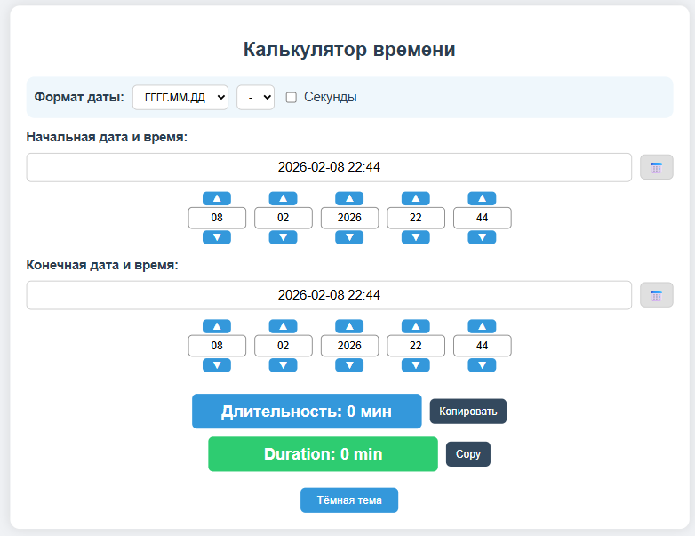
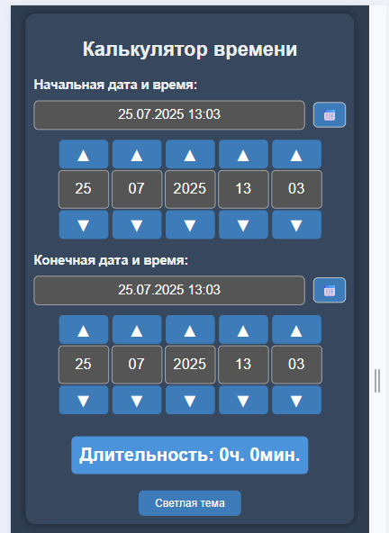

# Калькулятор времени

Простой и удобный веб-калькулятор для вычисления разницы между двумя датами и временем.  
Поддерживает ручной ввод и быстрые стрелки, тёмную и светлую тему, а также адаптацию под мобильные устройства.

  

[👉 Открыть калькулятор](https://dreamhousem.github.io/sla_calculator/)

---

## 📷 Скриншоты

  
  

  <em>Слева — десктопная, справа — мобильная версия</em>

---

## 🔧 Возможности

- ⌚ Ручной ввод даты и времени
- 🔼 Удобная настройка через стрелки
- 🌙 Поддержка светлой и тёмной темы
- 📱 Адаптивный дизайн для мобильных устройств
- 🚀 Работа прямо в браузере — ничего устанавливать не нужно

---

## 🛠️ Используемые технологии

- HTML, CSS, JavaScript
- [Flatpickr](https://flatpickr.js.org/) — кастомный календарь с локализацией и темами
